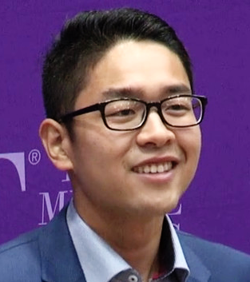

# Chuhao Liu

## AI Startup Founder

- CEO and Co-founder of [Sunflower AI](https://www.sunflowerai.io)
- Global Talent Visa receipient in Australia
- PhD dropout
- chuhao@sunflowerai.io

## Bio

> Chuhao Liu is an entreprenuer and influencer

## Interests

- Building startup
- Organising meetup [Blueprint protocol](https://protocol.bryanjohnson.co)
- Run marathon [top 0.1% in world](https://data.typeracer.com)

## Talks

- [3 Minute Thesis](https://www.youtube.com/watch?v=0kpJ52Fi94o), Explain my PhD research in 3 minutes

## Media

[Won National Early Researcher Showcase](https://www.uow.edu.au/media/2018/engineering-student-wins-national-early-researchers-showcase-competition.php)

## Links

- [LinkedIn](https://www.linkedin.com/in/chuhaoliuinnovation/)
- [Twitter](https://twitter.com/Chuhao__Liu)
- [Github](https://github.com/Chuhao95/)
